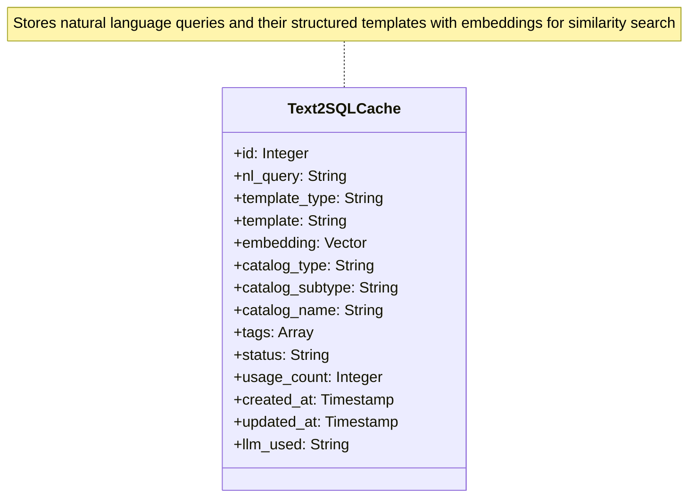
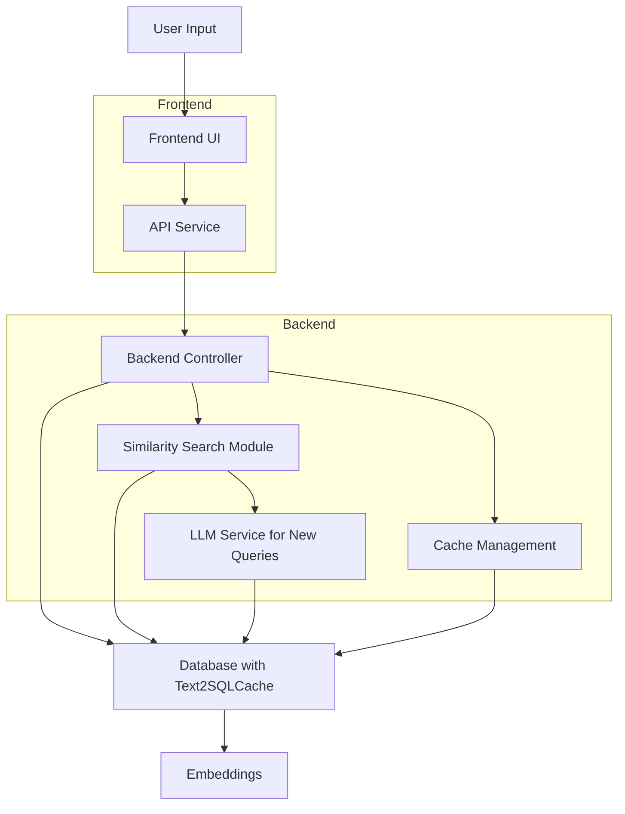
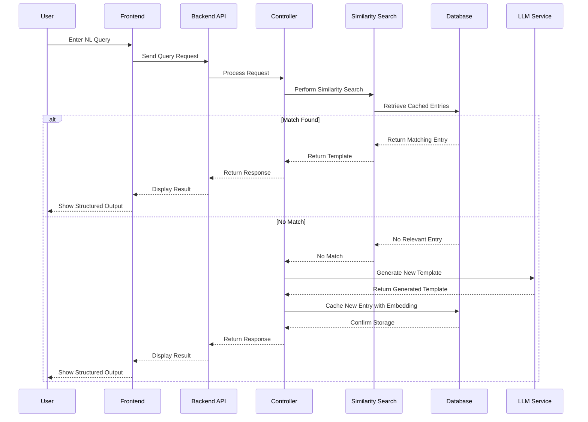

# NL Cache Framework

A framework for caching natural language queries and their corresponding structured outputs (like SQL, API calls, etc.) to improve retrieval and performance using similarity search.

## Overview

The NL Cache Framework is designed to cache natural language (NL) queries and map them to structured outputs such as SQL queries, API calls, URLs, or other templates. It uses embeddings for similarity search to retrieve the most relevant cached entry for a given input query, enhancing response accuracy and speed for applications dealing with natural language processing.

## Data Model

The core data model revolves around the `Text2SQLCache` table, which stores cached entries with their embeddings for similarity search.



## Framework Architecture

The framework consists of backend services for managing cache entries and similarity search, and a frontend for user interaction.



## Sequence Flow

The sequence diagram below illustrates the flow of a user query through the system, from input to retrieving or generating a response.



## Installation

To set up the NL Cache Framework locally, follow these steps:

1. **Clone the Repository**:
   ```bash
   git clone https://github.com/rnednur/nl_cache_framework.git
   cd nl_cache_framework
   ```

2. **Backend Setup**:
   - Navigate to the `backend` directory.
   - Install dependencies:
     ```bash
     pip install -r requirements.txt
     ```
   - Set up the database by running the initialization scripts in `dbscripts`.
   - Start the backend server:
     ```bash
     python app.py
     ```

3. **Frontend Setup**:
   - Navigate to the `frontend` directory.
   - Install dependencies:
     ```bash
     npm install
     ```
   - Start the frontend development server:
     ```bash
     npm run dev
     ```

4. **Environment Configuration**:
   - Ensure you have the necessary environment variables set for database connections and model configurations. Refer to `.env.example` for required variables.

## Usage

- **Access the Application**: Open your browser and navigate to `http://localhost:3000` (or the port specified by your frontend server) to interact with the UI.
- **Cache Management**: Use the dashboard to view, create, edit, or delete cache entries under `/cache-entries`.
- **Query Testing**: Test natural language queries at `/complete-test` to see the matched or generated structured outputs.

## Contributing

Contributions are welcome! Please follow these steps to contribute:

1. Fork the repository.
2. Create a new branch for your feature or bug fix.
3. Make your changes and commit them with descriptive messages.
4. Push your changes to your fork.
5. Submit a pull request to the main repository with a detailed description of your changes.

## License

This project is licensed under the MIT License - see the LICENSE file for details.

## Contact

For questions or support, please contact the project maintainer at [maintainer's email or GitHub profile].