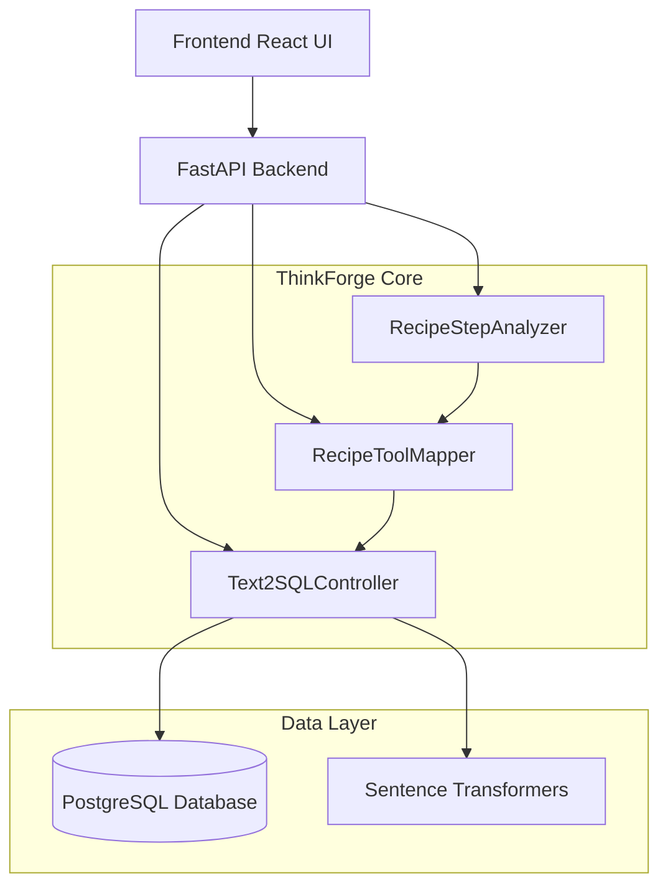
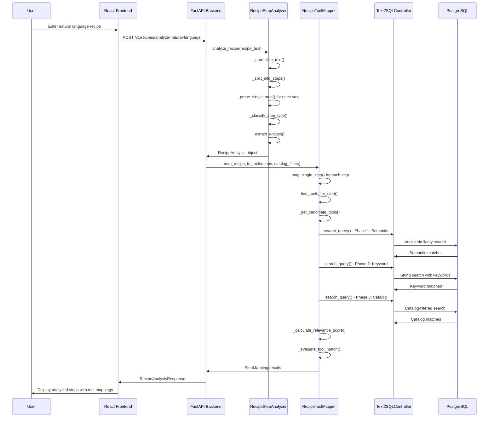
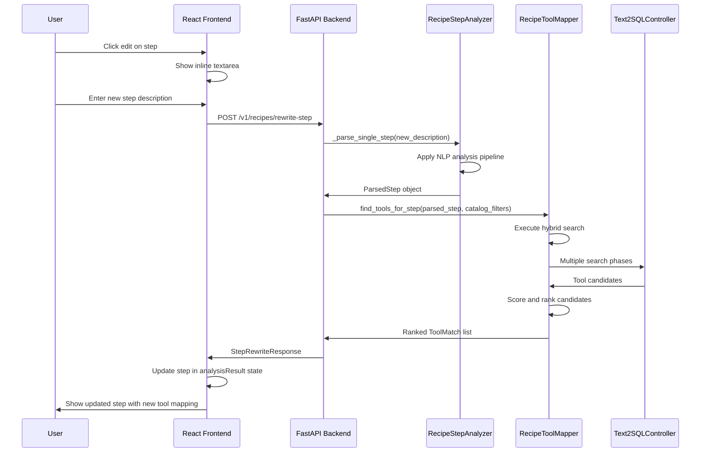

# Natural Language Recipe Analysis & Step Rewrite System - Code Flow Documentation

## Table of Contents
1. [System Architecture Overview](#system-architecture-overview)
2. [Data Flow Diagrams](#data-flow-diagrams)
3. [Component Deep Dive](#component-deep-dive)
4. [API Flow Documentation](#api-flow-documentation)
5. [Frontend Integration](#frontend-integration)
6. [Database Schema](#database-schema)
7. [Error Handling Patterns](#error-handling-patterns)
8. [Performance Considerations](#performance-considerations)

---

## System Architecture Overview

The ThinkForge Natural Language Recipe Analysis system is a sophisticated multi-layered architecture that transforms natural language descriptions into executable workflow steps with intelligent tool mapping.

### High-Level Architecture



### Core Components

| Component | Purpose | Key Responsibilities |
|-----------|---------|---------------------|
| **RecipeStepAnalyzer** | NLP Processing | Text normalization, step extraction, entity recognition, classification |
| **RecipeToolMapper** | Tool Matching | Hybrid search, confidence scoring, tool compatibility analysis |
| **Text2SQLController** | Data Access | Database queries, similarity search, embedding management |
| **FastAPI Backend** | API Layer | Request handling, data validation, response formatting |
| **React Frontend** | User Interface | User interaction, state management, real-time updates |

---

## Data Flow Diagrams

### Primary Recipe Analysis Flow



### Step Rewrite Flow



---

## Component Deep Dive

### 1. RecipeStepAnalyzer (`thinkforge/recipe_step_analyzer.py`)

**Purpose**: Transforms raw natural language text into structured, analyzable recipe steps.

#### Key Methods and Flow:

```python
class RecipeStepAnalyzer:
    def analyze_recipe(self, recipe_text: str, recipe_name: str = "") -> RecipeAnalysis:
        """Main entry point for recipe analysis"""
        
        # 1. Text Preprocessing
        normalized_text = self._normalize_text(recipe_text)
        
        # 2. Step Extraction
        raw_steps = self._split_into_steps(normalized_text)
        
        # 3. Individual Step Processing
        parsed_steps = []
        for i, raw_step in enumerate(raw_steps):
            step = self._parse_single_step(raw_step, i + 1)
            if step:
                parsed_steps.append(step)
        
        # 4. Dependency Analysis
        self._analyze_dependencies(parsed_steps)
        
        # 5. Complexity Calculation
        complexity_score = self._calculate_complexity(parsed_steps)
        
        return RecipeAnalysis(...)
```

#### Step Classification Algorithm:

```python
def _classify_step_type(self, text: str, action_verbs: List[str]) -> StepType:
    """Priority-based classification with scoring system"""
    
    scores = {
        StepType.INTEGRATION: 0,
        StepType.TRANSFORM: 0,
        StepType.VALIDATION: 0,
        StepType.CONDITION: 0,
        StepType.LOOP: 0,
        StepType.ACTION: 0
    }
    
    # Integration keywords (highest priority)
    integration_keywords = [
        'extract', 'fetch', 'get', 'retrieve', 'load', 
        'database', 'api', 'service', 'endpoint'
    ]
    
    # Score each category based on keyword presence
    for keyword in integration_keywords:
        if keyword in text.lower():
            scores[StepType.INTEGRATION] += 2
    
    # Return highest scoring type
    max_score = max(scores.values())
    if max_score > 0:
        for step_type, score in scores.items():
            if score == max_score:
                return step_type
```

#### Entity Extraction Process:

```python
def _extract_entities(self, text: str) -> List[str]:
    """Multi-layered entity extraction"""
    entities = []
    
    # 1. Quoted strings
    quoted = re.findall(r'"([^"]*)"', text)
    entities.extend(quoted)
    
    # 2. Technical nouns
    technical_nouns = [
        'customer', 'user', 'data', 'database', 'api',
        'json', 'xml', 'csv', 'email', 'notification'
    ]
    
    # 3. Compound technical terms
    technical_patterns = [
        r'\b(customer\s+data)\b',
        r'\b(api\s+endpoint)\b',
        r'\b(json\s+data)\b'
    ]
    
    # 4. Clean and deduplicate
    return list(set(clean_entities))
```

### 2. RecipeToolMapper (`thinkforge/recipe_tool_mapper.py`)

**Purpose**: Intelligent mapping between recipe steps and available tools using hybrid search strategies.

#### Hybrid Search Strategy:

```python
def _get_candidate_tools(self, step: ParsedStep, max_candidates: int, 
                        catalog_filters: Dict[str, str] = None) -> List[Dict[str, Any]]:
    """Three-phase hybrid search approach"""
    
    all_candidates = []
    
    # Phase 1: Semantic Search (Vector Similarity)
    for tool_type in relevant_types:
        results = self.controller.search_query(
            nl_query=search_query,
            template_type=tool_type,
            similarity_threshold=0.4,
            catalog_type=catalog_filters.get('catalog_type'),
            catalog_subtype=catalog_filters.get('catalog_subtype'),
            catalog_name=catalog_filters.get('catalog_name')
        )
        semantic_candidates.extend(results)
    
    # Phase 2: Keyword Search Fallback
    if len(semantic_candidates) < max_candidates // 2:
        keywords = step.action_verbs[:2] + step.entities[:3]
        keyword_candidates = self._keyword_search(step, relevant_types, 
                                                max_candidates, catalog_filters)
        all_candidates.extend(keyword_candidates)
    
    # Phase 3: Broad Catalog Search
    if len(all_candidates) < max_candidates // 3 and catalog_filters:
        catalog_candidates = self._catalog_search(step, catalog_filters, max_candidates)
        all_candidates.extend(catalog_candidates)
    
    # Remove duplicates and rank by relevance
    unique_candidates = self._deduplicate_and_rank(all_candidates, step)
    return unique_candidates[:max_candidates]
```

#### Tool Evaluation and Scoring:

```python
def _evaluate_tool_match(self, step: ParsedStep, tool_data: Dict[str, Any]) -> ToolMatch:
    """Multi-dimensional tool compatibility scoring"""
    
    # Component scores
    similarity_score = tool_data.get('similarity_score', 0.0)
    context_score = self._calculate_context_score(step, tool_data)
    compatibility_score = self._calculate_compatibility_score(step, tool_data)
    
    # Weighted combination
    weights = {'similarity': 0.4, 'context': 0.3, 'compatibility': 0.3}
    overall_confidence = (
        similarity_score * weights['similarity'] +
        context_score * weights['context'] +
        compatibility_score * weights['compatibility']
    )
    
    return ToolMatch(
        tool_id=tool_data['id'],
        overall_confidence=overall_confidence,
        reasoning=self._generate_match_reasoning(...)
    )
```

#### Search Query Building:

```python
def _build_search_query(self, step: ParsedStep) -> str:
    """Optimized search query construction"""
    query_parts = []
    
    # 1. Prioritized action verbs
    priority_verbs = ['extract', 'fetch', 'get', 'retrieve', 'query']
    sorted_verbs = [v for v in priority_verbs if v in step.action_verbs]
    query_parts.extend(sorted_verbs[:3])
    
    # 2. Technical entities
    priority_entities = ['database', 'api', 'service', 'customer', 'data']
    sorted_entities = [e for e in priority_entities if e in step.entities]
    query_parts.extend(sorted_entities[:4])
    
    # 3. Domain-specific keywords
    domain_keywords = []
    if 'database' in step.description.lower():
        domain_keywords.extend(['database', 'query', 'sql'])
    
    query_parts.extend(domain_keywords[:2])
    
    # 4. Step type context
    if step.step_type != StepType.UNKNOWN:
        query_parts.append(step.step_type.value)
    
    return " ".join(dict.fromkeys(query_parts))  # Deduplicate while preserving order
```

### 3. Text2SQLController (`thinkforge/controller.py`)

**Purpose**: Database operations, similarity search, and embedding management.

#### Search Query Method:

```python
def search_query(
    self,
    nl_query: str,
    template_type: Optional[str] = None,
    search_method: str = "vector",
    similarity_threshold: float = 0.8,
    limit: int = 5,
    catalog_type: Optional[str] = None,
    catalog_subtype: Optional[str] = None,
    catalog_name: Optional[str] = None,
    status: Optional[str] = Status.ACTIVE,
) -> List[Dict[str, Any]]:
    """Multi-method search with catalog filtering"""
    
    # Build base query
    query = self.session.query(Text2SQLCache)
    
    # Apply filters
    if template_type:
        query = query.filter(Text2SQLCache.template_type == template_type)
    if catalog_type:
        query = query.filter(Text2SQLCache.catalog_type == catalog_type)
    if catalog_subtype:
        query = query.filter(Text2SQLCache.catalog_subtype == catalog_subtype)
    if catalog_name:
        query = query.filter(Text2SQLCache.catalog_name == catalog_name)
    if status:
        query = query.filter(Text2SQLCache.status == status)
    
    # Execute search based on method
    if search_method == "vector":
        return self._vector_search(query, nl_query, similarity_threshold, limit)
    elif search_method == "string":
        return self._string_search(query, nl_query, limit)
    else:
        return self._auto_search(query, nl_query, similarity_threshold, limit)
```

---

## API Flow Documentation

### 1. Recipe Analysis Endpoint

**Endpoint**: `POST /v1/recipes/analyze-natural-language`

#### Request Structure:

```json
{
  "recipe_text": "1. Extract customer data from database\n2. Transform data to JSON format\n3. Send notification email",
  "recipe_name": "Customer Data Processing",
  "similarity_threshold": 0.6,
  "max_matches_per_step": 5,
  "catalog_type": "data-integration",
  "catalog_subtype": "database",
  "catalog_name": "customer-operations"
}
```

#### Processing Flow:

```python
async def analyze_recipe_natural_language(request: RecipeAnalysisRequest, db: Session):
    # 1. Initialize components
    controller = Text2SQLController(db_session=db)
    step_analyzer = RecipeStepAnalyzer()
    tool_mapper = RecipeToolMapper(db_session=db, controller=controller)
    
    # 2. Analyze recipe text
    recipe_analysis = step_analyzer.analyze_recipe(
        recipe_text=request.recipe_text,
        recipe_name=request.recipe_name or "Generated Recipe"
    )
    
    # 3. Prepare catalog filters
    catalog_filters = {}
    if request.catalog_type:
        catalog_filters['catalog_type'] = request.catalog_type
    if request.catalog_subtype:
        catalog_filters['catalog_subtype'] = request.catalog_subtype
    if request.catalog_name:
        catalog_filters['catalog_name'] = request.catalog_name
    
    # 4. Map steps to tools
    step_mappings = tool_mapper.map_recipe_to_tools(
        steps=recipe_analysis.steps,
        similarity_threshold=request.similarity_threshold,
        max_matches_per_step=request.max_matches_per_step,
        catalog_filters=catalog_filters if catalog_filters else None
    )
    
    # 5. Convert to response format
    parsed_steps = []
    for mapping in step_mappings:
        # Transform ToolMatch to MappedToolInfo
        mapped_tool = None
        if mapping.best_match:
            mapped_tool = MappedToolInfo(
                id=mapping.best_match.tool_id,
                cache_entry_id=mapping.best_match.tool_id,
                confidence=mapping.best_match.overall_confidence,
                reasoning=mapping.best_match.reasoning,
                # ... other fields
            )
        
        parsed_steps.append(ParsedRecipeStep(
            id=mapping.step.id,
            mapped_tool=mapped_tool,
            alternative_tools=[...],  # Convert alternative matches
            requires_review=mapping.requires_manual_review,
            suggestions=mapping.suggestions
        ))
    
    return RecipeAnalysisResponse(
        recipe_name=recipe_analysis.recipe_name,
        steps=parsed_steps,
        complexity_score=recipe_analysis.complexity_score,
        # ... other fields
    )
```

#### Response Structure:

```json
{
  "recipe_name": "Customer Data Processing",
  "description": "Customer Data Processing",
  "steps": [
    {
      "id": "step_1",
      "name": "Extract customer data from database",
      "description": "Extract customer data from database",
      "step_type": "integration",
      "confidence": 0.85,
      "action_verbs": ["extract"],
      "entities": ["customer", "data", "database", "customer data"],
      "mapped_tool": {
        "id": 123,
        "cache_entry_id": 123,
        "name": "PostgreSQL Customer Query",
        "type": "api",
        "confidence": 0.92,
        "reasoning": "High semantic similarity; Strong contextual compatibility; Tool is healthy and reliable",
        "exists": true,
        "needs_creation": false,
        "similarity_score": 0.91,
        "context_score": 0.88,
        "compatibility_score": 0.95
      },
      "alternative_tools": [
        {
          "id": 124,
          "name": "Customer Database API",
          "confidence": 0.78
        }
      ],
      "requires_review": false,
      "suggestions": ["Good match found! Review the suggested tool for compatibility."]
    }
  ],
  "total_steps": 3,
  "complexity_score": 0.45,
  "estimated_duration": 8,
  "required_capabilities": ["api-integration", "data-transformation", "notification"],
  "recipe_type": "integration"
}
```

### 2. Step Rewrite Endpoint

**Endpoint**: `POST /v1/recipes/rewrite-step`

#### Request Structure:

```json
{
  "step_id": "step_1",
  "new_description": "Query customer database using SQL to retrieve user account information",
  "similarity_threshold": 0.6,
  "max_matches": 5,
  "catalog_type": "data-integration",
  "catalog_subtype": "database",
  "catalog_name": "customer-operations"
}
```

#### Processing Flow:

```python
async def rewrite_recipe_step(request: StepRewriteRequest, db: Session):
    # 1. Initialize components
    controller = Text2SQLController(db_session=db)
    step_analyzer = RecipeStepAnalyzer()
    tool_mapper = RecipeToolMapper(db_session=db, controller=controller)
    
    # 2. Parse new step description
    parsed_step = step_analyzer._parse_single_step(request.new_description, 1)
    parsed_step.id = request.step_id  # Override ID to match request
    
    # 3. Prepare catalog filters
    catalog_filters = {}
    if request.catalog_type:
        catalog_filters['catalog_type'] = request.catalog_type
    # ... other filters
    
    # 4. Find tool matches
    tool_matches = tool_mapper.find_tools_for_step(
        step=parsed_step,
        max_results=request.max_matches,
        catalog_filters=catalog_filters if catalog_filters else None
    )
    
    # 5. Filter by threshold and convert to response format
    filtered_matches = [m for m in tool_matches if m.overall_confidence >= request.similarity_threshold]
    
    # 6. Build response with analysis changes
    analysis_changes = {
        "description_changed": True,
        "new_step_type": parsed_step.step_type.value,
        "new_confidence": parsed_step.confidence,
        "tools_found": len(filtered_matches),
        "best_match_confidence": filtered_matches[0].overall_confidence if filtered_matches else 0.0,
        "processing_timestamp": time.time()
    }
    
    return StepRewriteResponse(
        original_step=original_step,  # Placeholder in current implementation
        rewritten_step=rewritten_step,
        analysis_changes=analysis_changes
    )
```

---

## Frontend Integration

### React Component Structure

```typescript
// Main Recipe Creation Component
export default function NewRecipe() {
  // State Management
  const [analysisResult, setAnalysisResult] = useState<RecipeAnalysis | null>(null)
  const [rewritingStepId, setRewritingStepId] = useState<string | null>(null)
  const [rewriteText, setRewriteText] = useState('')
  const [isRewriting, setIsRewriting] = useState(false)
  
  // Recipe Analysis Handler
  const analyzeNaturalLanguage = async () => {
    setIsAnalyzing(true)
    try {
      const apiResponse = await api.analyzeRecipeText({
        recipe_text: naturalLanguageText,
        recipe_name: formData.nl_query || 'Generated Recipe',
        catalog_type: formData.catalog_type || undefined,
        catalog_subtype: formData.catalog_subtype || undefined,
        catalog_name: formData.catalog_name || undefined
      })
      
      // Convert API response to frontend format
      const analysisResult: RecipeAnalysis = {
        recipeName: apiResponse.recipe_name,
        steps: apiResponse.steps.map(step => ({
          id: step.id,
          stepType: step.step_type,
          mappedTool: step.mapped_tool ? {
            cacheEntryId: step.mapped_tool.cache_entry_id,
            needsCreation: step.mapped_tool.needs_creation
          } : undefined
        }))
      }
      
      setAnalysisResult(analysisResult)
    } catch (error) {
      setError(error.message)
    } finally {
      setIsAnalyzing(false)
    }
  }
  
  // Step Rewrite Handler
  const handleRewriteStep = async (stepId: string, newDescription: string) => {
    setIsRewriting(true)
    try {
      const rewriteResponse = await api.rewriteRecipeStep({
        step_id: stepId,
        new_description: newDescription,
        catalog_type: formData.catalog_type || undefined,
        catalog_subtype: formData.catalog_subtype || undefined,
        catalog_name: formData.catalog_name || undefined
      })
      
      // Update analysis result with rewritten step
      if (analysisResult) {
        const updatedSteps = analysisResult.steps.map(step => 
          step.id === stepId ? {
            ...rewriteResponse.rewritten_step,
            stepType: rewriteResponse.rewritten_step.step_type,
            actionVerbs: rewriteResponse.rewritten_step.action_verbs,
            mappedTool: rewriteResponse.rewritten_step.mapped_tool ? {
              ...rewriteResponse.rewritten_step.mapped_tool,
              cacheEntryId: rewriteResponse.rewritten_step.mapped_tool.cache_entry_id,
              needsCreation: rewriteResponse.rewritten_step.mapped_tool.needs_creation
            } : undefined
          } : step
        )
        
        setAnalysisResult({...analysisResult, steps: updatedSteps})
      }
      
      setRewritingStepId(null)
      setRewriteText('')
      toast.success('Step rewritten and reanalyzed successfully!')
    } catch (error) {
      toast.error(`Failed to rewrite step: ${error.message}`)
    } finally {
      setIsRewriting(false)
    }
  }
}
```

### UI Component Interaction Flow

```typescript
// Step Display with Rewrite Capability
{analysisResult.steps.map((step, index) => (
  <div key={step.id} className="border border-neutral-600 rounded-lg p-3 bg-neutral-800">
    <div className="flex items-start justify-between gap-3">
      <div className="flex-1 min-w-0">
        <div className="flex items-center gap-2 mb-1">
          <span className="text-sm font-medium text-white">
            {index + 1}. {step.name}
          </span>
          <Badge variant="outline">{step.stepType}</Badge>
          <Button
            size="sm"
            variant="ghost"
            onClick={() => startRewriteStep(step.id, step.description)}
            disabled={rewritingStepId === step.id}
          >
            <Edit3 className="h-3 w-3" />
          </Button>
        </div>
        
        {rewritingStepId === step.id ? (
          <div className="space-y-2 mb-2">
            <Textarea
              value={rewriteText}
              onChange={(e) => setRewriteText(e.target.value)}
              placeholder="Rewrite the step description..."
              disabled={isRewriting}
            />
            <div className="flex gap-2">
              <Button
                size="sm"
                onClick={() => handleRewriteStep(step.id, rewriteText)}
                disabled={isRewriting || !rewriteText.trim()}
              >
                {isRewriting ? (
                  <Loader2 className="h-3 w-3 mr-1 animate-spin" />
                ) : (
                  <RefreshCw className="h-3 w-3 mr-1" />
                )}
                {isRewriting ? 'Rewriting...' : 'Rewrite'}
              </Button>
              <Button
                size="sm"
                variant="ghost"
                onClick={cancelRewriteStep}
                disabled={isRewriting}
              >
                <X className="h-3 w-3 mr-1" />Cancel
              </Button>
            </div>
          </div>
        ) : (
          <p className="text-xs text-neutral-300 mb-2">
            {step.description}
          </p>
        )}
        
        {/* Tool Mapping Display */}
        {step.mappedTool ? (
          <div className="space-y-2">
            <div className="flex items-center gap-2">
              <Target className="h-3 w-3 text-blue-400" />
              <span className="text-xs font-medium text-neutral-200">
                {step.mappedTool.name} ({step.mappedTool.type})
              </span>
              <Badge className={getConfidenceColor(step.mappedTool.confidence)}>
                {Math.round(step.mappedTool.confidence * 100)}%
              </Badge>
            </div>
            
            {step.mappedTool.exists ? (
              <div className="flex items-center gap-2">
                <CheckCircle className="h-3 w-3 text-green-400" />
                <span className="text-xs text-neutral-300">
                  Cache Entry ID: {step.mappedTool.cacheEntryId}
                </span>
                <Button onClick={() => handleViewTool(step.mappedTool.cacheEntryId)}>
                  <ExternalLink className="h-3 w-3 mr-1" />View Tool
                </Button>
              </div>
            ) : (
              <div className="flex items-center gap-2">
                <AlertCircle className="h-3 w-3 text-orange-400" />
                <span className="text-xs text-orange-300">
                  Tool needs to be created
                </span>
                <Button onClick={() => handleCreateTool(step.id, step.mappedTool)}>
                  <PlusCircle className="h-3 w-3 mr-1" />Create Tool
                </Button>
              </div>
            )}
          </div>
        ) : (
          <div className="flex items-center gap-2 text-neutral-400">
            <AlertTriangle className="h-3 w-3" />
            <span className="text-xs">No tool mapped</span>
          </div>
        )}
      </div>
    </div>
  </div>
))}
```

---

## Database Schema

### Core Tables

```sql
-- Main cache table for tools and recipes
CREATE TABLE text2sql_cache (
    id SERIAL PRIMARY KEY,
    nl_query TEXT NOT NULL,
    template TEXT NOT NULL,
    template_type VARCHAR(50) NOT NULL,
    is_template BOOLEAN DEFAULT FALSE,
    embedding VECTOR(384),  -- Sentence transformer embeddings
    status VARCHAR(20) DEFAULT 'active',
    usage_count INTEGER DEFAULT 0,
    
    -- Catalog organization
    catalog_type VARCHAR(100),
    catalog_subtype VARCHAR(100),
    catalog_name VARCHAR(100),
    
    -- Tool-specific fields
    tool_capabilities TEXT[],
    tool_dependencies JSONB,
    execution_config JSONB,
    health_status VARCHAR(20) DEFAULT 'unknown',
    
    -- Recipe-specific fields
    recipe_steps JSONB,
    required_tools INTEGER[],
    execution_time_estimate INTEGER,
    complexity_level VARCHAR(20),
    
    -- Timestamps
    created_at TIMESTAMP DEFAULT CURRENT_TIMESTAMP,
    updated_at TIMESTAMP DEFAULT CURRENT_TIMESTAMP
);

-- Usage logging for analytics
CREATE TABLE usage_log (
    id SERIAL PRIMARY KEY,
    cache_entry_id INTEGER REFERENCES text2sql_cache(id),
    query_text TEXT,
    template_type VARCHAR(50),
    similarity_score REAL,
    
    -- New columns for enhanced logging
    response TEXT,
    considered_entries JSONB,
    is_confident BOOLEAN DEFAULT FALSE,
    
    -- Catalog context
    catalog_type VARCHAR(100),
    catalog_subtype VARCHAR(100),
    catalog_name VARCHAR(100),
    
    timestamp TIMESTAMP DEFAULT CURRENT_TIMESTAMP
);

-- Audit log for changes
CREATE TABLE cache_audit_log (
    id SERIAL PRIMARY KEY,
    cache_entry_id INTEGER REFERENCES text2sql_cache(id),
    action VARCHAR(50) NOT NULL,
    changes JSONB,
    changed_by VARCHAR(100),
    change_reason TEXT,
    timestamp TIMESTAMP DEFAULT CURRENT_TIMESTAMP
);
```

### Indexes for Performance

```sql
-- Vector similarity search
CREATE INDEX idx_text2sql_cache_embedding ON text2sql_cache USING ivfflat (embedding vector_cosine_ops);

-- Catalog filtering
CREATE INDEX idx_text2sql_cache_catalog ON text2sql_cache (catalog_type, catalog_subtype, catalog_name);

-- Template type filtering
CREATE INDEX idx_text2sql_cache_template_type ON text2sql_cache (template_type);

-- Status and usage filtering
CREATE INDEX idx_text2sql_cache_status ON text2sql_cache (status);
CREATE INDEX idx_text2sql_cache_usage_count ON text2sql_cache (usage_count DESC);

-- Usage log analytics
CREATE INDEX idx_usage_log_timestamp ON usage_log (timestamp DESC);
CREATE INDEX idx_usage_log_cache_entry ON usage_log (cache_entry_id);
```

---

## Error Handling Patterns

### Backend Error Handling

```python
# API Endpoint Error Handling
@app.post("/v1/recipes/analyze-natural-language")
async def analyze_recipe_natural_language(request: RecipeAnalysisRequest, db: Session):
    try:
        # Main processing logic
        logger.info(f"Analyzing recipe: {request.recipe_name or 'Unnamed'}")
        
        # Component initialization with error checking
        controller = Text2SQLController(db_session=db)
        step_analyzer = RecipeStepAnalyzer()
        tool_mapper = RecipeToolMapper(db_session=db, controller=controller)
        
        # Analysis with individual error handling
        recipe_analysis = step_analyzer.analyze_recipe(
            recipe_text=request.recipe_text,
            recipe_name=request.recipe_name or "Generated Recipe"
        )
        
        # Tool mapping with fallback handling
        step_mappings = tool_mapper.map_recipe_to_tools(
            steps=recipe_analysis.steps,
            similarity_threshold=request.similarity_threshold,
            max_matches_per_step=request.max_matches_per_step,
            catalog_filters=catalog_filters if catalog_filters else None
        )
        
        logger.info(f"Successfully analyzed recipe with {len(parsed_steps)} steps")
        return response
        
    except HTTPException:
        # Re-raise HTTP exceptions (validation errors, etc.)
        raise
    except Exception as e:
        # Log detailed error information
        error_msg = f"Recipe analysis failed: {str(e)}"
        logger.error(error_msg, exc_info=True)
        
        # Return structured error response
        raise HTTPException(status_code=500, detail=error_msg)

# Component-Level Error Handling
class RecipeStepAnalyzer:
    def _parse_single_step(self, raw_text: str, order: int) -> Optional[ParsedStep]:
        try:
            # Step parsing logic
            parsed_step = ParsedStep(...)
            return parsed_step
            
        except Exception as e:
            logger.error(f"Failed to parse step {order}: {e}")
            return None  # Graceful degradation
    
    def analyze_recipe(self, recipe_text: str, recipe_name: str = "") -> RecipeAnalysis:
        # Individual step processing with error isolation
        parsed_steps = []
        for i, raw_step in enumerate(raw_steps):
            try:
                step = self._parse_single_step(raw_step, i + 1)
                if step:
                    parsed_steps.append(step)
            except Exception as e:
                logger.warning(f"Skipping malformed step {i + 1}: {e}")
                continue  # Skip problematic steps rather than failing entire analysis

# Database Error Handling
class Text2SQLController:
    def search_query(self, nl_query: str, **kwargs) -> List[Dict[str, Any]]:
        try:
            # Database operations
            query = self.session.query(Text2SQLCache)
            results = query.all()
            return [result.to_dict() for result in results]
            
        except SQLAlchemyError as e:
            logger.error(f"Database error in search_query: {e}")
            self.session.rollback()
            raise HTTPException(status_code=500, detail="Database operation failed")
        except Exception as e:
            logger.error(f"Unexpected error in search_query: {e}")
            raise HTTPException(status_code=500, detail="Search operation failed")
```

### Frontend Error Handling

```typescript
// API Service Error Handling
class ApiService {
  async analyzeRecipeText(request: RecipeAnalysisRequest): Promise<RecipeAnalysisResponse> {
    try {
      const response = await fetch(`${API_BASE}/v1/recipes/analyze-natural-language`, {
        method: 'POST',
        headers: {'Content-Type': 'application/json'},
        body: JSON.stringify(request),
      });
      
      if (!response.ok) {
        // Parse error response
        const errorData = await response.json().catch(() => ({}));
        throw new Error(errorData.detail || `HTTP error! status: ${response.status}`);
      }
      
      return await response.json();
    } catch (error) {
      console.error('Error analyzing recipe text:', error);
      throw error; // Re-throw for component handling
    }
  }
}

// Component Error Handling
export default function NewRecipe() {
  const [error, setError] = useState<string | null>(null)
  
  const analyzeNaturalLanguage = async () => {
    setIsAnalyzing(true)
    setError(null) // Clear previous errors
    
    try {
      const apiResponse = await api.analyzeRecipeText({
        recipe_text: naturalLanguageText,
        recipe_name: formData.nl_query || 'Generated Recipe',
        // ... other params
      })
      
      setAnalysisResult(analysisResult)
      
    } catch (err: any) {
      console.error('Recipe analysis failed:', err)
      
      // User-friendly error messages
      let errorMessage = 'Failed to analyze recipe. Please try again.'
      if (err.message.includes('network')) {
        errorMessage = 'Network error. Please check your connection and try again.'
      } else if (err.message.includes('timeout')) {
        errorMessage = 'Analysis is taking longer than expected. Please try again.'
      } else if (err.message) {
        errorMessage = err.message
      }
      
      setError(errorMessage)
    } finally {
      setIsAnalyzing(false)
      setAnalysisProgress(0)
    }
  }
  
  // Error Display Component
  {error && (
    <Alert variant="destructive">
      <AlertTriangle className="h-4 w-4" />
      <AlertDescription>{error}</AlertDescription>
    </Alert>
  )}
}
```

---

## Performance Considerations

### Database Optimization

#### Vector Search Performance

```sql
-- Optimal vector index configuration
CREATE INDEX idx_text2sql_cache_embedding ON text2sql_cache 
USING ivfflat (embedding vector_cosine_ops) 
WITH (lists = 100);  -- Adjust based on data size

-- Query optimization for hybrid search
EXPLAIN ANALYZE
SELECT id, nl_query, template_type, similarity_score
FROM (
  SELECT *, (embedding <=> query_embedding) AS similarity_score
  FROM text2sql_cache 
  WHERE template_type = ANY($1)
    AND catalog_type = $2
    AND status = 'active'
) ranked
WHERE similarity_score < 0.6  -- Cosine distance threshold
ORDER BY similarity_score
LIMIT 10;
```

#### Query Optimization Patterns

```python
# Efficient pagination for large result sets
def search_query_paginated(self, nl_query: str, page: int = 0, page_size: int = 10):
    offset = page * page_size
    
    query = self.session.query(Text2SQLCache)\
        .filter(Text2SQLCache.status == Status.ACTIVE)\
        .order_by(Text2SQLCache.usage_count.desc())\
        .offset(offset)\
        .limit(page_size)
    
    return query.all()

# Batch processing for multiple embeddings
def batch_generate_embeddings(self, texts: List[str]) -> List[np.ndarray]:
    """Generate embeddings in batches for better GPU utilization"""
    batch_size = 32
    embeddings = []
    
    for i in range(0, len(texts), batch_size):
        batch = texts[i:i + batch_size]
        batch_embeddings = self.similarity_util.get_embedding(batch)
        embeddings.extend(batch_embeddings)
    
    return embeddings
```

### Memory Management

```python
# Efficient data structures for large-scale processing
class RecipeToolMapper:
    def __init__(self, db_session: Session, controller: Text2SQLController):
        self.session = db_session
        self.controller = controller
        
        # Cache frequently used data
        self._tool_type_cache = {}
        self._confidence_thresholds = self._get_mapping_thresholds()
    
    def _get_candidate_tools_optimized(self, step: ParsedStep, max_candidates: int):
        """Memory-efficient candidate tool retrieval"""
        
        # Use generator for large result sets
        def candidate_generator():
            for tool_type in self._get_relevant_tool_types(step):
                results = self.controller.search_query(
                    nl_query=search_query,
                    template_type=tool_type,
                    limit=max_candidates // len(relevant_types) + 2
                )
                for result in results:
                    yield result
        
        # Process candidates in chunks to avoid memory spikes
        candidates = []
        for candidate in candidate_generator():
            candidates.append(candidate)
            if len(candidates) >= max_candidates:
                break
        
        return candidates
```

### Caching Strategies

```python
# Application-level caching
from functools import lru_cache
import redis

class RecipeAnalysisCache:
    def __init__(self):
        self.redis_client = redis.Redis(host='localhost', port=6379, db=0)
        self.cache_ttl = 3600  # 1 hour
    
    @lru_cache(maxsize=1000)
    def get_step_classification_cache(self, step_text: str) -> StepType:
        """Cache step classifications to avoid recomputation"""
        # This will be cached in memory
        return self._classify_step_type(step_text)
    
    def cache_analysis_result(self, recipe_text_hash: str, result: RecipeAnalysis):
        """Cache full analysis results in Redis"""
        cache_key = f"recipe_analysis:{recipe_text_hash}"
        serialized_result = json.dumps(result, default=str)
        self.redis_client.setex(cache_key, self.cache_ttl, serialized_result)
    
    def get_cached_analysis(self, recipe_text_hash: str) -> Optional[RecipeAnalysis]:
        """Retrieve cached analysis result"""
        cache_key = f"recipe_analysis:{recipe_text_hash}"
        cached_result = self.redis_client.get(cache_key)
        if cached_result:
            return json.loads(cached_result)
        return None
```

### Frontend Performance

```typescript
// Debounced search for step rewriting
import { debounce } from 'lodash'
import { useMemo, useCallback } from 'react'

export default function NewRecipe() {
  // Memoized expensive computations
  const analysisStats = useMemo(() => {
    if (!analysisResult) return null
    
    return {
      totalSteps: analysisResult.steps.length,
      mappedSteps: analysisResult.steps.filter(s => s.mappedTool).length,
      highConfidenceSteps: analysisResult.steps.filter(s => 
        s.mappedTool && s.mappedTool.confidence > 0.8
      ).length,
      avgConfidence: analysisResult.steps
        .filter(s => s.mappedTool)
        .reduce((sum, s) => sum + s.mappedTool!.confidence, 0) / 
        analysisResult.steps.filter(s => s.mappedTool).length
    }
  }, [analysisResult])
  
  // Debounced step rewrite to avoid excessive API calls
  const debouncedRewriteStep = useCallback(
    debounce(async (stepId: string, newDescription: string) => {
      await handleRewriteStep(stepId, newDescription)
    }, 500),
    [handleRewriteStep]
  )
  
  // Virtual scrolling for large step lists
  const virtualizedSteps = useMemo(() => {
    if (!analysisResult || analysisResult.steps.length < 50) {
      return analysisResult?.steps || []
    }
    
    // Implement virtual scrolling for large lists
    return analysisResult.steps.slice(0, 20) // Show first 20, implement virtual scrolling
  }, [analysisResult])
}
```

### Monitoring and Metrics

```python
# Performance monitoring
import time
from functools import wraps

def monitor_performance(func):
    @wraps(func)
    def wrapper(*args, **kwargs):
        start_time = time.time()
        try:
            result = func(*args, **kwargs)
            duration = time.time() - start_time
            logger.info(f"{func.__name__} completed in {duration:.2f}s")
            return result
        except Exception as e:
            duration = time.time() - start_time
            logger.error(f"{func.__name__} failed after {duration:.2f}s: {e}")
            raise
    return wrapper

class RecipeStepAnalyzer:
    @monitor_performance
    def analyze_recipe(self, recipe_text: str, recipe_name: str = "") -> RecipeAnalysis:
        # Analysis implementation
        return recipe_analysis
    
    @monitor_performance
    def _parse_single_step(self, raw_text: str, order: int) -> Optional[ParsedStep]:
        # Step parsing implementation
        return parsed_step

# Metrics collection
class MetricsCollector:
    def __init__(self):
        self.metrics = {
            'analysis_count': 0,
            'average_analysis_time': 0,
            'step_rewrite_count': 0,
            'tool_match_success_rate': 0
        }
    
    def record_analysis(self, duration: float, step_count: int, matched_steps: int):
        self.metrics['analysis_count'] += 1
        self.metrics['average_analysis_time'] = (
            (self.metrics['average_analysis_time'] * (self.metrics['analysis_count'] - 1) + duration) 
            / self.metrics['analysis_count']
        )
        self.metrics['tool_match_success_rate'] = (
            (self.metrics['tool_match_success_rate'] * (self.metrics['analysis_count'] - 1) + 
             (matched_steps / step_count)) / self.metrics['analysis_count']
        )
```

---

## Summary

This documentation provides a comprehensive overview of the Natural Language Recipe Analysis and Step Rewrite system's code flow. The system demonstrates sophisticated NLP processing, intelligent tool matching, and user-friendly interface design that enables users to transform natural language descriptions into executable workflows with high accuracy and flexibility.

Key architectural strengths:
- **Modular Design**: Clear separation of concerns between NLP, tool mapping, and data access layers
- **Hybrid Search**: Multi-phase search strategy combining semantic similarity, keyword matching, and catalog filtering
- **Real-time Interaction**: Step-by-step rewrite capability with immediate feedback
- **Performance Optimization**: Efficient database queries, caching strategies, and memory management
- **Robust Error Handling**: Graceful degradation and comprehensive error reporting

The system successfully bridges the gap between natural language intent and executable tool workflows, providing users with powerful capabilities for recipe analysis and refinement.