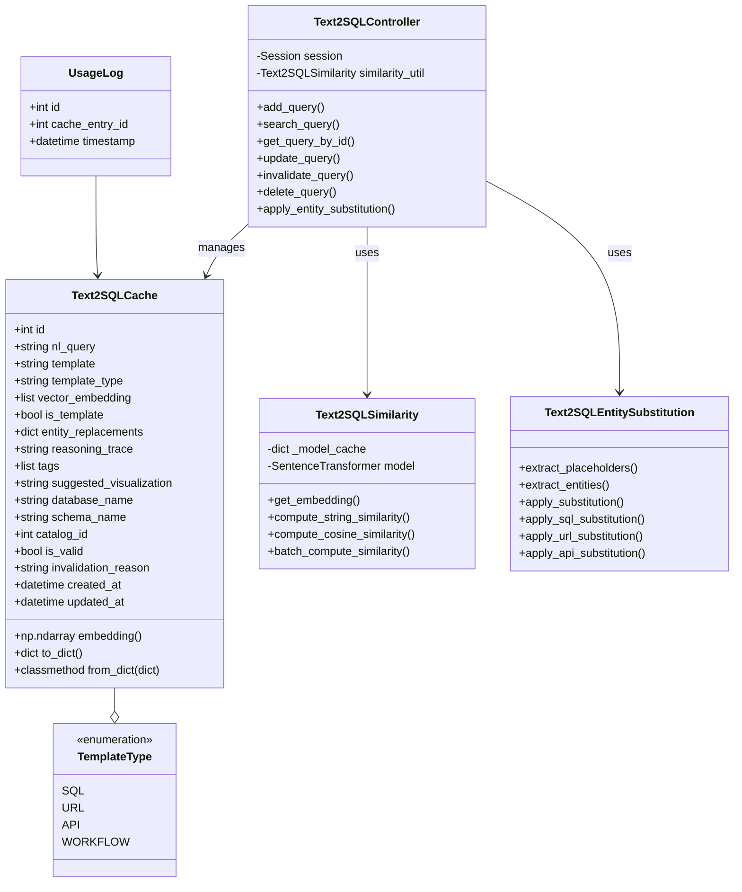

```mermaid
classDiagram
    class Text2SQLCache {
        +int id
        +string nl_query
        +string template
        +string template_type
        +list vector_embedding
        +bool is_template
        +dict entity_replacements
        +string reasoning_trace
        +list tags
        +string suggested_visualization
        +string database_name
        +string schema_name
        +int catalog_id
        +bool is_valid
        +string invalidation_reason
        +datetime created_at
        +datetime updated_at
        +np.ndarray embedding()
        +dict to_dict()
        +classmethod from_dict(dict)
    }
    
    class UsageLog {
        +int id
        +int cache_entry_id
        +datetime timestamp
    }
    
    class TemplateType {
        <<enumeration>>
        SQL
        URL
        API
        WORKFLOW
    }
    
    class Text2SQLController {
        -Session session
        -Text2SQLSimilarity similarity_util
        +add_query()
        +search_query()
        +get_query_by_id()
        +update_query()
        +invalidate_query()
        +delete_query()
        +apply_entity_substitution()
    }
    
    class Text2SQLSimilarity {
        -dict _model_cache
        -SentenceTransformer model
        +get_embedding()
        +compute_string_similarity()
        +compute_cosine_similarity()
        +batch_compute_similarity()
    }
    
    class Text2SQLEntitySubstitution {
        +extract_placeholders()
        +extract_entities()
        +apply_substitution()
        +apply_sql_substitution()
        +apply_url_substitution()
        +apply_api_substitution()
    }
    
    Text2SQLCache --o TemplateType
    UsageLog --> Text2SQLCache
    Text2SQLController --> Text2SQLCache : manages
    Text2SQLController --> Text2SQLSimilarity : uses
    Text2SQLController --> Text2SQLEntitySubstitution : uses
``` 