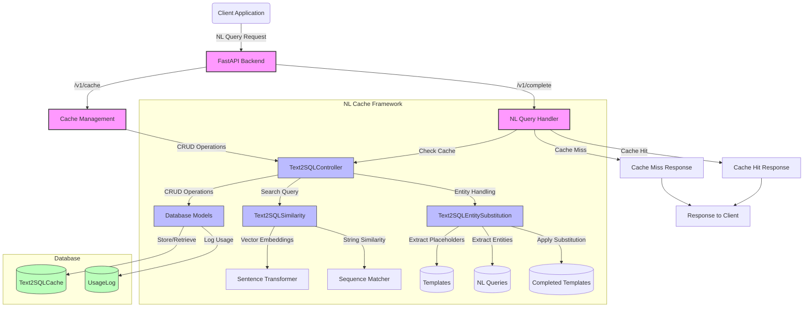

```mermaid
flowchart TD
    %% Main Flow
    Client(Client Application) -->|NL Query Request| FastAPI[FastAPI Backend]
    FastAPI -->|/v1/complete| NLQueryHandler[NL Query Handler]
    
    %% Core NL Cache Framework Components
    subgraph "NL Cache Framework"
        NLQueryHandler -->|Check Cache| Controller[Text2SQLController]
        Controller -->|Search Query| SimilarityUtil[Text2SQLSimilarity]
        Controller -->|CRUD Operations| DBModels[Database Models]
        Controller -->|Entity Handling| EntitySub[Text2SQLEntitySubstitution]
        
        %% Similarity Component
        SimilarityUtil -->|Vector Embeddings| SentenceTransformer[Sentence Transformer]
        SimilarityUtil -->|String Similarity| SequenceMatcher[Sequence Matcher]
        
        %% Entity Substitution Component
        EntitySub -->|Extract Placeholders| Templates[(Templates)]
        EntitySub -->|Extract Entities| NLQuery[(NL Queries)]
        EntitySub -->|Apply Substitution| CompletedTemplate[(Completed Templates)]
    end
    
    %% Database
    subgraph "Database"
        DBModels -->|Store/Retrieve| CacheEntries[(Text2SQLCache)]
        DBModels -->|Log Usage| UsageLog[(UsageLog)]
    end
    
    %% Response Paths
    NLQueryHandler -->|Cache Hit| CacheHitResponse[Cache Hit Response]
    NLQueryHandler -->|Cache Miss| CacheMissResponse[Cache Miss Response]
    
    CacheHitResponse --> ResponseToClient[Response to Client]
    CacheMissResponse --> ResponseToClient
    
    %% Other API Endpoints
    FastAPI -->|/v1/cache| CacheManagement[Cache Management]
    CacheManagement -->|CRUD Operations| Controller
    
    %% API Routes Legend
    classDef apiEndpoint fill:#f9f,stroke:#333,stroke-width:2px;
    class FastAPI,CacheManagement,NLQueryHandler apiEndpoint;
    
    %% Component Legend
    classDef framework fill:#bbf,stroke:#333,stroke-width:1px;
    class Controller,SimilarityUtil,EntitySub,DBModels framework;
    
    %% Database Legend
    classDef db fill:#bfb,stroke:#333,stroke-width:1px;
    class CacheEntries,UsageLog db;
``` 