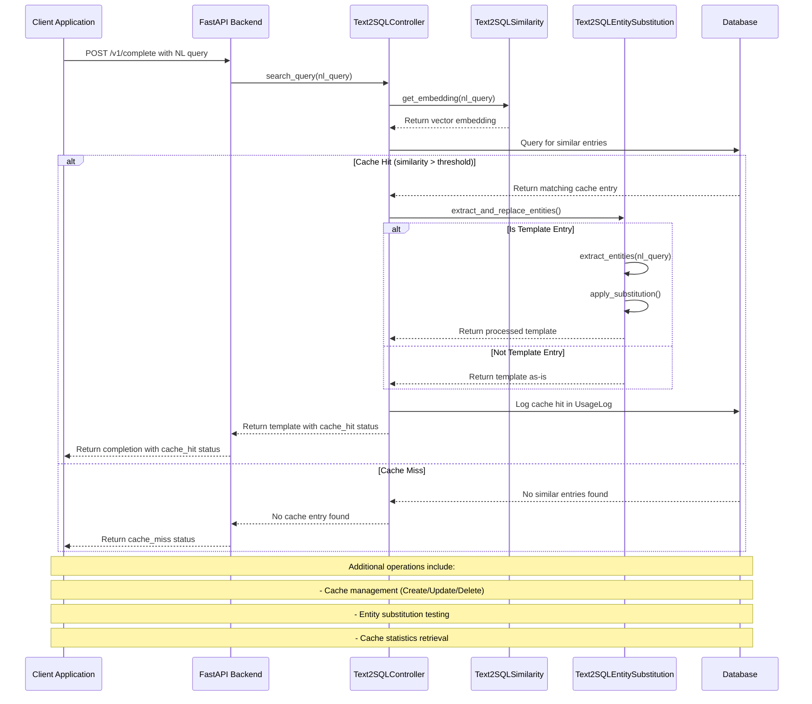

```mermaid
sequenceDiagram
    participant Client as Client Application
    participant FastAPI as FastAPI Backend
    participant Controller as Text2SQLController
    participant Similarity as Text2SQLSimilarity
    participant EntitySub as Text2SQLEntitySubstitution
    participant DB as Database

    Client->>FastAPI: POST /v1/complete with NL query
    FastAPI->>Controller: search_query(nl_query)
    
    %% Cache Search Process
    Controller->>Similarity: get_embedding(nl_query)
    Similarity-->>Controller: Return vector embedding
    Controller->>DB: Query for similar entries
    
    alt Cache Hit (similarity > threshold)
        DB-->>Controller: Return matching cache entry
        Controller->>EntitySub: extract_and_replace_entities()
        
        alt Is Template Entry
            EntitySub->>EntitySub: extract_entities(nl_query)
            EntitySub->>EntitySub: apply_substitution()
            EntitySub-->>Controller: Return processed template
        else Not Template Entry
            EntitySub-->>Controller: Return template as-is
        end
        
        Controller->>DB: Log cache hit in UsageLog
        Controller-->>FastAPI: Return template with cache_hit status
        FastAPI-->>Client: Return completion with cache_hit status
    else Cache Miss
        DB-->>Controller: No similar entries found
        Controller-->>FastAPI: No cache entry found
        FastAPI-->>Client: Return cache_miss status
    end
    
    %% Other Possible Operations
    note over Client,DB: Additional operations include:
    note over Client,DB: - Cache management (Create/Update/Delete)
    note over Client,DB: - Entity substitution testing
    note over Client,DB: - Cache statistics retrieval
``` 