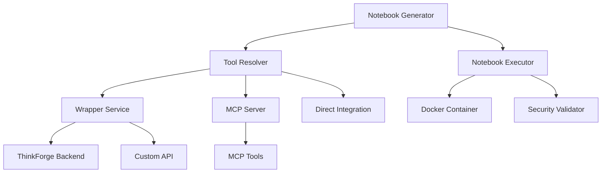

# Notebook Sandbox

A secure, reusable notebook execution environment with wrapper service integration for dynamic tool resolution and execution.

[](https://www.python.org/downloads/)
[](https://opensource.org/licenses/MIT)

## 🌟 Features

- **🔒 Secure Execution**: Resource-limited containers with security validation
- **🔌 Pluggable Tool Resolution**: Support for wrapper services, MCP servers, and custom resolvers
- **📝 Dynamic Notebook Generation**: Convert DSL workflows to executable Python notebooks
- **🐳 Docker Integration**: Containerized execution with health monitoring
- **🛡️ Security Validation**: Pre-execution security and syntax checking
- **⚡ Async/Await Support**: Modern Python async patterns throughout
- **📊 Rich Templates**: Pre-built templates for SQL, API, data transformation, and more

## 🚀 Quick Start

### Installation

```bash
pip install notebook-sandbox
```

Or install from source:

```bash
git clone https://github.com/your-org/notebook-sandbox.git
cd notebook-sandbox
pip install -e .
```

### Basic Usage

```python
import asyncio
from notebook_sandbox import NotebookExecutor, PythonNotebookGenerator
from notebook_sandbox.generators import GenerationRequest, NotebookMetadata

async def main():
    # Initialize executor
    executor = NotebookExecutor()
    
    # Generate notebook from workflow
    generator = PythonNotebookGenerator()
    
    workflow = {
        "steps": [
            {
                "name": "Load Data",
                "description": "Load customer data from database",
                "type": "sql"
            },
            {
                "name": "Analyze Data", 
                "description": "Perform statistical analysis",
                "type": "script"
            }
        ]
    }
    
    request = GenerationRequest(
        content=workflow,
        workflow_name="customer_analysis"
    )
    
    result = await generator.generate(request)
    
    if result.success:
        # Save and execute notebook
        with open("analysis.ipynb", "w") as f:
            f.write(result.notebook_content)
        
        execution_result = executor.execute_notebook("analysis.ipynb")
        print(f"Execution completed: {execution_result.success}")

asyncio.run(main())
```

## 🏗️ Architecture

### Core Components

```
notebook_sandbox/
├── core/                    # Core execution engine
│   ├── executor.py         # Notebook execution with resource limits
│   ├── validator.py        # Security and syntax validation  
│   ├── container_manager.py # Docker container management
│   └── api_server.py       # FastAPI REST server
├── generators/             # Notebook generation system
│   ├── base_generator.py   # Abstract generator interface
│   ├── python_generator.py # Python notebook generator
│   └── cell_templates.py   # Reusable cell templates
├── integrations/           # Wrapper service integrations
│   ├── tool_resolver.py    # Abstract tool resolution interface
│   ├── wrapper_client.py   # Generic wrapper service client
│   └── mcp_client.py      # Model Context Protocol client
└── config/                # Configuration management
    ├── resources.py        # Resource limit configuration
    └── security.py         # Security policy configuration
```

### Integration Pattern



## 🔌 Wrapper Service Integration

### Generic Wrapper Client

```python
from notebook_sandbox import WrapperClient, PythonNotebookGenerator

async with WrapperClient("http://your-service:8080") as wrapper:
    # List available tools
    tools = await wrapper.list_tools()
    
    # Resolve tools for a task
    result = await wrapper.resolve_tools("query database for users")
    
    # Generate notebook with resolved tools
    generator = PythonNotebookGenerator(tool_resolver=wrapper)
    notebook = await generator.generate(request)
```

### MCP (Model Context Protocol) Integration

```python
from notebook_sandbox import MCPClient

async with MCPClient("http://mcp-server:8000") as mcp:
    # MCP tool discovery
    tools = await mcp.list_tools()
    
    # Execute MCP tools
    result = await mcp.execute_tool("database_query", {
        "query": "SELECT * FROM users"
    })
    
    # Generate notebook with MCP tools
    generator = PythonNotebookGenerator(tool_resolver=mcp)
```

### ThinkForge Integration

```python
from notebook_sandbox import WrapperClient

# Connect to ThinkForge backend
async with WrapperClient("http://thinkforge:8000") as thinkforge:
    # Generate from DSL workflow
    dsl_workflow = {
        "nodes": [...],
        "edges": [...]
    }
    
    generator = PythonNotebookGenerator(tool_resolver=thinkforge)
    result = await generator.generate(GenerationRequest(
        content=dsl_workflow,
        workflow_name="thinkforge_workflow"
    ))
```

## 🛡️ Security Features

### Resource Limits

```python
from notebook_sandbox.config import ResourceConfig

config = ResourceConfig(
    max_memory_mb=512,        # Memory limit
    max_cpu_time=300,         # CPU time limit in seconds
    max_wall_time=600,        # Wall clock time limit
    max_file_size_mb=100,     # File size limit
    max_processes=10          # Process count limit
)
```

### Security Validation

```python
from notebook_sandbox.config import SecurityConfig

config = SecurityConfig(
    strict_mode=True,                    # Strict security validation
    allow_network_access=False,          # Block network access
    allow_file_system_access=False,      # Block file system access
    dangerous_imports={'os', 'sys'},     # Blocked imports
    allowed_imports={'pandas', 'numpy'}  # Allowed imports
)
```

### Validation Example

```python
from notebook_sandbox import NotebookValidator

validator = NotebookValidator()
result = validator.validate_notebook_content(notebook_json)

if result["valid"]:
    print("✅ Notebook is secure")
else:
    print(f"❌ Found {result['issue_count']} security issues")
    for issue in result["issues"]:
        print(f"  - {issue['severity']}: {issue['message']}")
```

## 🐳 Docker Integration

### Container Management

```python
from notebook_sandbox import ContainerManager

manager = ContainerManager()

# Start sandbox container
success = await manager.start_container()

# Check status
status = await manager.get_container_status()
print(f"Container status: {status['status']}")

# Execute commands
result = await manager.exec_command(["python", "--version"])
print(f"Python version: {result['stdout']}")

# Stop container
await manager.stop_container()
```

### Docker Compose Configuration

```yaml
version: '3.8'
services:
  notebook-sandbox:
    image: notebook-sandbox:latest
    ports:
      - "8888:8888"
    environment:
      - MAX_MEMORY_MB=512
      - MAX_CPU_TIME=300
      - WRAPPER_SERVICE_URL=http://wrapper:8080
    security_opt:
      - no-new-privileges:true
    cap_drop:
      - ALL
```

## 📝 Template System

### Built-in Templates

- **Header**: Markdown headers with metadata
- **Setup**: Standard imports and configuration
- **SQL Query**: Database query execution with error handling
- **API Request**: HTTP requests with response handling
- **Data Transform**: Data manipulation with validation
- **Python Script**: General Python code execution
- **Validation**: Result validation and testing
- **Summary**: Workflow summary and results

### Custom Templates

```python
from notebook_sandbox.generators import CellTemplate, CellType

# Create custom template
template = CellTemplate(
    name="custom_analysis",
    cell_type=CellType.CODE,
    template="""
# {step_name}: {description}
import custom_lib

result = custom_lib.analyze({input_data})
print(f"Analysis complete: {{result}}")
""",
    variables=["step_name", "description", "input_data"]
)

# Add to template library
library = CellTemplateLibrary()
library.add_template(template)
```

## 🌐 REST API

Start the API server:

```bash
# Command line
sandbox-server

# Or in Python
from notebook_sandbox.core.api_server import main
main()
```

### API Endpoints

```bash
# Health check
GET /health

# Notebook management
GET /notebooks
POST /notebooks/upload
POST /notebooks/generate
DELETE /notebooks/{path}

# Execution
POST /notebooks/execute
GET /notebooks/execution/{id}
GET /notebooks/executions

# Container management
POST /container/start
POST /container/stop
GET /container/status

# Configuration
GET /config
POST /config/update
```

### API Usage Example

```python
import aiohttp

async with aiohttp.ClientSession() as session:
    # Generate notebook
    async with session.post("http://localhost:8888/notebooks/generate", json={
        "content": {"steps": [...]},
        "workflow_name": "api_example"
    }) as resp:
        result = await resp.json()
        print(f"Generated: {result['filename']}")
    
    # Execute notebook
    async with session.post("http://localhost:8888/notebooks/execute", json={
        "notebook_path": result['filename']
    }) as resp:
        execution = await resp.json()
        execution_id = execution['execution_id']
    
    # Check status
    async with session.get(f"http://localhost:8888/notebooks/execution/{execution_id}") as resp:
        status = await resp.json()
        print(f"Status: {status['status']}")
```

## 🔧 Configuration

### Environment Variables

```bash
# Resource limits
export MAX_MEMORY_MB=512
export MAX_CPU_TIME=300
export MAX_WALL_TIME=600
export MAX_FILE_SIZE_MB=100

# Security settings
export STRICT_MODE=true
export ALLOW_NETWORK_ACCESS=false
export ALLOW_FILE_SYSTEM_ACCESS=false

# Service integration
export WRAPPER_SERVICE_URL=http://wrapper:8080
export MCP_SERVER_URL=http://mcp:8000
export AUTH_TOKEN=your-token
```

### Configuration Files

```python
# config.py
from notebook_sandbox.config import ResourceConfig, SecurityConfig

resource_config = ResourceConfig.from_dict({
    "max_memory_mb": 1024,
    "max_cpu_time": 600,
    "allow_errors": False
})

security_config = SecurityConfig.from_dict({
    "strict_mode": True,
    "allowed_imports": ["pandas", "numpy", "requests"],
    "max_cell_count": 50
})
```

## 📚 Examples

### Basic Workflow Execution

See [examples/basic_usage.py](examples/basic_usage.py) for a complete example of:
- Notebook generation from workflow description
- Security validation
- Notebook execution with resource limits
- Result handling

### Wrapper Service Integration

See [examples/wrapper_integration.py](examples/wrapper_integration.py) for examples of:
- Generic wrapper client usage
- MCP server integration
- ThinkForge backend integration
- Tool resolution and execution

### Custom Generator

```python
from notebook_sandbox.generators import BaseNotebookGenerator

class CustomGenerator(BaseNotebookGenerator):
    def __init__(self):
        super().__init__("custom_generator")
    
    async def generate(self, request):
        # Custom generation logic
        return GenerationResult(
            notebook_content=self._create_custom_notebook(request),
            cell_count=5,
            success=True
        )
    
    def validate_input(self, content):
        return "custom_format" in content
    
    def get_supported_formats(self):
        return ["custom_format"]
```

## 🤝 Contributing

1. Fork the repository
2. Create a feature branch (`git checkout -b feature/amazing-feature`)
3. Commit your changes (`git commit -m 'Add amazing feature'`)
4. Push to the branch (`git push origin feature/amazing-feature`)
5. Open a Pull Request

### Development Setup

```bash
# Clone and setup
git clone https://github.com/your-org/notebook-sandbox.git
cd notebook-sandbox

# Install in development mode
pip install -e .[dev]

# Run tests
pytest

# Code formatting
black .
isort .

# Type checking
mypy notebook_sandbox/
```

## 📄 License

This project is licensed under the MIT License - see the [LICENSE](LICENSE) file for details.

## 🙏 Acknowledgments

- [Jupyter](https://jupyter.org/) for the notebook format
- [FastAPI](https://fastapi.tiangolo.com/) for the web framework
- [Docker](https://www.docker.com/) for containerization
- [ThinkForge](https://github.com/thinkforge) for the original inspiration

## 📞 Support

- 📧 Email: support@notebook-sandbox.dev
- 🐛 Issues: [GitHub Issues](https://github.com/your-org/notebook-sandbox/issues)
- 📖 Documentation: [Read the Docs](https://notebook-sandbox.readthedocs.io/)
- 💬 Discord: [Community Server](https://discord.gg/notebook-sandbox)